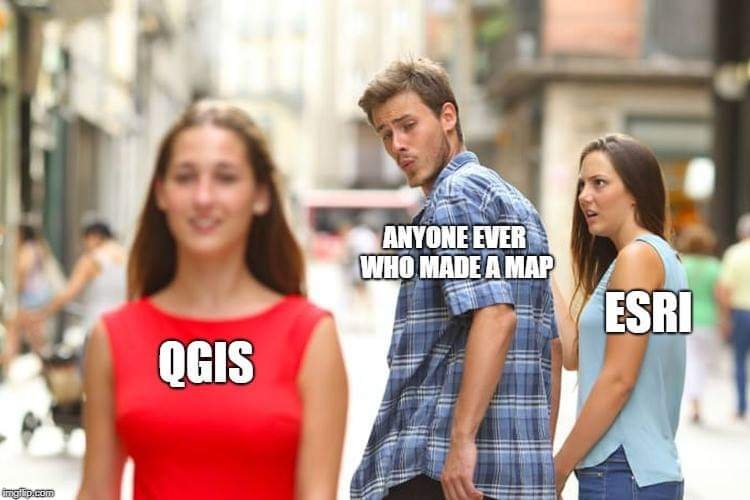

class: introduction
# Spatial Analysis Software  
Our lab's expertise lies in MANY softwares (which is extremely cool), they include:  
- ArcGIS (proprietary/click & point)

--

- ENVI (proprietary)

--

- QGIS (click & point)

--

- Google Earth Engine 

--

- R   
  
--
  
<br><br><br>
Why do you prefer other softwares over R for your spatial analysis?

---
class: introduction 
# Very Briefly - Some Advantages 
- Reproducibility/Documentation 
- Continuity 
- Visualization
- RESOURCES (see the end of this presentation)
- All the other usual stuff 

```{r, echo=F, out.height='35%', out.width='65%', fig.align='center'}

```

.footnote[[fig. source](https://twitter.com/Donny_V/status/1056208331830894592)]
---

class: mainconcepts
# Package network 
LOTS of packages for spatial analysis in R - can get really specific for specific analysis types/goals. Today, we are going to focus on absolute basics, to get data into R, visualize it, and do some simple (and sometimes less simple) analyses:  

1. Vector data -> `sf`
2. Raster data -> `stars` or `terra` 
3. Interactive visualization -> `mapview`
4. Basemaps -> `osmdata` 
5. Static visualization -> `ggplot2` 

.footnote[[sf](https://r-spatial.github.io/sf/), [stars](https://r-spatial.github.io/stars/), [terra](https://rspatial.org/terra/pkg/1-introduction.html), [mapview](https://r-spatial.github.io/mapview/), [osmdata](https://docs.ropensci.org/osmdata/), 
[ggplot2](https://ggplot2.tidyverse.org/)]
---
class: chapterone 
# Data Exploration 
Things to NOTE
- crs 
- attributes 
- geometry 
- FILE SIZE 
- terra vs stars


---
class: chaptertwo
# Vector Analysis with sf 

---
class: chaptertwo 
# Raster Analysis with stars

---
class: chapterthree 
# Visualization

---
class: mainconcepts 
# Resources 
- [data.table in R Guide](https://www.machinelearningplus.com/data-manipulation/datatable-in-r-complete-guide/)


```{r, eval = F, echo = F}
library(pagedown)
pagedown::chrome_print("/home/icrichmond/Repositories/workshops/data-cleaning/presentation/presentation-slides.html")
```